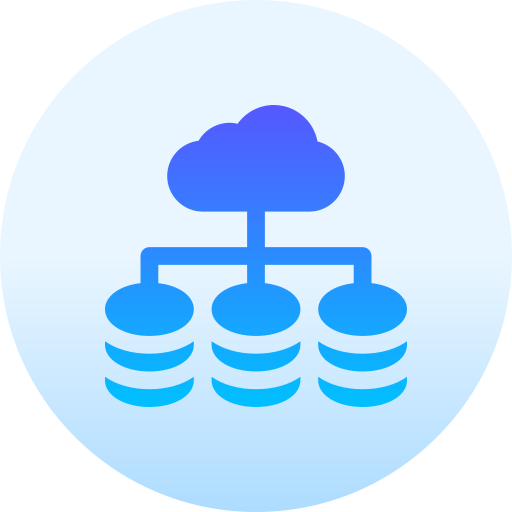

:information_source: &nbsp;This repository is about gathering any useful resources and information regarding DevOps and secondly, provide some roadmap for those who want to practice DevOps.

:pencil: &nbsp;Feel free to add more resources by submitting pull requests

****

<!-- ALL-TOPICS-LIST:START -->
<!-- prettier-ignore-start -->
<!-- markdownlint-disable -->

<table>
  <tr>
    <td align="center"><a href="#devops"> <b>DevOps</b></a></td>
    <td align="center"><a href="resources/jenkins/README.md"> <b>Jenkins</b></a></td>
    <td align="center"><a href="resources/git.md"> <b>Git</b></a></td>
    <td align="center"><a href="resources/ansible.md"> <b>Ansible</b></a></td>
    <td align="center"><a href="resources/network.md"> <b>Network</b></a></td>
    <td align="center"><a href="resources/linux.md"> <b>Linux</b></a></td>
    <td align="center"><a href="resources/terraform.md"> <b>Terraform</b></a></td>
  </tr>
  <tr>
    <td align="center"><a href="resources/coding.md"> <b>Coding</b></a></td>
    <td align="center"><a href="resources/python.md"> <b>Python</b></a></td>
    <td align="center"><a href="resources/go.md"> <b>Go</b></a></td>
    <td align="center"><a href="resources/bash.md"> <b>Shell Scripting</b></a></td>
    <td align="center"><a href="resources/kubernetes.md"> <b>Kubernetes</b></a></td>
    <td align="center"><a href="resources/victoriametrics.md"> <b>VictoriaMetrics</b></a></td>
    <td align="center"><a href="resources/prometheus.md"> <b>Prometheus</b></a></td>
    <td align="center"><a href="resources/mongo.md"> <b>Mongo</b></a></td>
  </tr>
  <tr>
    <td align="center"><a href="resources/cloud.md"> <b>Cloud</b></a></td>
    <td align="center"><a href="resources/aws.md"> <b>AWS</b></a></td>
    <td align="center"><a href="resources/azure.md"> <b>Azure</b></a></td>
    <td align="center"><a href="resources/gcp.md"> <b>Google Cloud Platform</b></a></td>
    <td align="center"><a href="resources/openstack.md"> <b>OpenStack</b></a></td>
    <td align="center"><a href="resources/security.md"> <b>Security</b></a></td>
    <td align="center"><a href="resources/puppet.md"> <b>Puppet</b></a></td>
  </tr>

  <tr>
    <td align="center"><a href="resources/elk.md"> <b>ELK</b></a></td>
    <td align="center"><a href="resources/dataops.md"> <b>DataOps</b></a></td>
    <td align="center"><a href="resources/openshift.md"> <b>OpenShift</b></a></td>
    <td align="center"><a href="resources/sql.md"> <b>SQL</b></a></td>
    <td align="center"><a href="resources/containers.md"> <b>Containers</b></a></td>
  </tr>
</table>

<!-- markdownlint-enable -->
<!-- prettier-ignore-end -->
<!-- ALL-TOPICS-LIST:END -->

* [DevOps Roadmap](#devops-roadmap)
* [Alternative Roadmaps](#alternative-roadmaps)
* [Learn About DevOps](#learn-about-devops)
* [Learn Git](#learn-git)
* [Programming](#programming)
* [Operating Systems](#operating-systems)
* [DevOps Toolchain](#devops-toolchain)

## DevOps

### DevOps Roadmap

  * The following path is opinionated. You can find alternative paths in the [alternative roadmaps section](#alternative-roadmaps)
  * Do NOT attempt to learn everything, especially if you are a complete beginner (the burnout will make you regret you ever heard the word DevOps)
  * Learn enough to say "I know what is DevOps and I understand how to practice it". You can learn everything else by demand or when you feel ready

The must list

Topic | What to learn | Alternatives | Description
:------|:------|:------|:------:
Version Control | [Git](#Learn-git) | - | Version Control is used everywhere and Git is the leading version control technology
Programming | At least one [programming language](#programming) | None. Don't settle for learning only shell scripting  | Anyone who practice DevOps should know programming to some extent
Operating System | [Linux](#operating-systems) | Other distribution of Linux :D | Operating Systems is another must when it comes to DevOps
Protocols | DHCP, UDP, TCP, HTTP, SSH | Not as an alternative, you can simply learn later: NFS, NTP, FTP | Learn how these protocols work and what they are used for
Applications | Web Server, Load Balancer, Cache, Database | | Learn how they work and try out some implementations (e.g. MySQL for databases and httpd for web servers)
[System Design](https://github.com/bregman-arie/system-design-notebook) | Availability, Reliability, Scalability, Performance | Learn how to design infrastructure and systems

The second must list :)
Seriously though, don't try to master everything in this list and start with something that you are interested in. The order has no meaning in this case.

Topic | What to learn | Alternatives | Description
:------|:------|:------|:------:
Configuration Management and IaC | Ansible and Terraform | CM: Chef, Puppet and Salt. IaC: Pulumi and CloudFormation |
Cloud | Azure, AWS, GCP | - |
Containers | Podman and Kubernetes| Docker instead of Podman. Nomad instead of Kubernetes | 
CI/CD | Jenkins, GitHub Actions | Gitlab CI, Circle CI, Argo CD |
Logging and Dashboards | Elastic Stack, Report Portal, Grafana | Graylog, Splunk |
Monitoring | VictoriaMetrics, Prometheus | Nagios, Centreon, Datadog | 

### Alternative Roadmaps

There are other DevOps roadmaps and learning plans out there. If you feel the one above is little bit too much or just want to look at other options, maybe you'll find the following useful

Name | Description
:------|:------:
[DevOps Roadmap](https://github.com/kamranahmedse/developer-roadmap) | DevOps skills roadmap. What to to learn at each step.
[DevOps 3 Weeks Plan](https://medium.com/@medineshkatwal/devops-3-week-plan-from-16-oct-2019-to-31st-oct-2019-af486e625f72) | Detailed plan on what to do at each day
[How to Become a DevOps Engineer in Six Months?](https://spacelift.io/blog/how-to-become-devops-engineer) | Skills you need to become DevOps Engineer

### Learn about DevOps

Name | Description
:------|:------:
[What is DevOps? - Amazon](https://aws.amazon.com/devops) | Learn what is DevOps by Amazon and which AWS services can help you to practice DevOps
[What is DevOps? - Red Hat](https://www.redhat.com/en/topics/devops) | Learn what is DevOps by Red Hat, including many interesting articles
[What is DevOps? - Microsoft](https://docs.microsoft.com/en-us/azure/devops/learn/what-is-devops) | Learn what is DevOps by Microsofy, including Azure DevOps service
[What is DevOps? - Google](https://cloud.google.com/devops) | Learn what is DevOps by Google
[Who is DevOps? - Spacelift](https://spacelift.io/blog/who-is-devops-engineer) | Who is DevOps? Is it Worth it to Become a DevOps Engineer?

### Learn Git

Make sure you are comfortable with the following list once you done learning Git basics

  * Commit changes to a project
  * Submit pull/merge requests
  * Working with branches
  * Rebase changes (change order, squash, ...)

Name | Description
:------|:------:
[Interactive Git Branching Learning](https://learngitbranching.js.org/) | Visual and interactive way to learn Git branching
[Learn git concepts, not commands](https://dev.to/unseenwizzard/learn-git-concepts-not-commands-4gjc) | Article on Git concepts
[Codeacademy Learn Git](https://www.codecademy.com/learn/learn-git) | Not Free 

### Programming

Practicing DevOps without knowing programming is like eating cornflakes with ketchup - it's just doesn't makes sense (yes, my analogies are the worst). 
Here is a list of some good sites to practice programming in general:

Name | Comments
:------|:------:
[HackerRank](https://www.hackerrank.com) | Practice Coding skills
[Exercism](https://exercism.io) | Over 48 languages and 2600 exercises
[LeetCode](https://leetcode.com) | Practice programming online

A better approach might be to actually write some DevOps related scripts or projects. Start simple. Here are some ideas:

  * Write a script that gets a number of instances and a name of a platform (AWS, local, Azure, ...) as parameters and provisions those instances on the chosen platform
  * Write a script to parse logs and extract some specific information you are interested in
  * Write a script that extracts information from some website using web scraping libraries

### Operating Systems

Deep dive into operation system internals. Linux should be your first choice.
Here is a list of resources that will help you learn Linux. 
Also, don't waste a second on picking the right distribution. For learning OS concepts and internals, any distribution would work fine.

Name | Comments
:------|:------:
[Linux Journey](https://linuxjourney.com) | Written guides + exercises + quiz
[Techmint Linux](https://www.tecmint.com/free-online-linux-learning-guide-for-beginners) | Written articles/lessons
[Linux Survival](https://linuxsurvival.com/linux-tutorial-introduction) | Interactive guide

Once you are familiar with the commands and feel comfortable enough to keep deep diving, learn some OS concepts:

  * Memory Management
  * Processes
  * Kernel
  * Virtualization
  * Storage

#### Linux Master Application

A completely free application for testing your knowledge on Linux

### System Design

System Design can be a complex topic. For that reason, I've created a separate repository for you to learn it properly.

### Tooling, Apps & Services

Name | Description
:------|:------:
[Periodic table of DevOps tools](https://xebialabs.com/periodic-table-of-devops-tools) | Table of DevOps tools per category
[DevOps tool chest](https://xebialabs.com/the-ultimate-devops-tool-chest/#tool-chest-type) | List of DevOps tools
[DevOps Bookmarks](http://www.devopsbookmarks.com) | NSIA
[CNCF Cloud Native Interactive Landscape](https://landscape.cncf.io) | CNCF's recommended path through the cloud native landscape
[DevOpsBookmarks](https://www.devopsbookmarks.org) | To discover tools in the devops landscape.

## Interactive practice and learning sites

Learning by doing proved to be a very effective way to learn new things. If you are at a point where you don't feel comfortable enough to do it by yourself and you look for some guidance, the following sites might assist you

Name | Description
:------|:------:
[Kodekloud Engineer](https://www.kodekloud-engineer.com/) | perform real tasks by working in a fictional organization
[QWIKLBAS](https://www.qwiklabs.com) | AWS, GCP, ... lab practice

## Community

Another great way to learn is to learn from the experience of others. For that, the are some excellent DevOps communities.

Name | Comments
:------|:------:
[Reddit DevOps](https://www.reddit.com/r/devops) | Reddit DevOps Community 
[Linkedin DevOps](https://www.linkedin.com/groups/2825397) | Linkedin DevOps Community
[DevOps Bits](https://www.facebook.com/groups/538897960007080) | Facebook DevOps group. Disclosure: I started it :)

## Conferences

Name | Comments
:------|:------:
[DevOpsDays](https://devopsdays.org) | DevOps Conferences around the world
[Velocity](https://conferences.oreilly.com/velocity) | Oracle's DevOps conference

## Books

Read book! Practice is important and the best way to learn practical things but reading about cultures, methods, concepts, ... has its own important role in your path towards mastering DevOps and SRE.

Name | Comments
:------|:------:
[The Phoenix Project](https://www.amazon.com/Phoenix-Project-DevOps-Helping-Business/dp/1942788290) | DevOps explained through a story of a fictional company on the brink of a failure
[The DevOps Handbook](https://www.amazon.com/dp/1942788002) |
[Google SRE books](https://landing.google.com/sre/books) | Very detailed books on the theory and also practice of SRE
[Essential Infrastructure as Code](https://www.manning.com/books/essential-infrastructure-as-code) | VBook about automating software infrastructure by capturing desired configurations as a set of scripts.

## Blogs & News

My top picks:

Name | Description
:------|:------:
[Codefresh Blog](https://codefresh.io/blog) | Probably best GitOps content out there

Other DevOps & Software Engineering related blogs

Name | Description
:------|:------:
[Spacelift Blog](https://spacelift.io/blog) | Excellent tech blog on Kubernetes, Ansible, Terraform and Engineering in general
[opensource.com](https://opensource.com) | open source related articles including DevOps
[CooperPress](https://cooperpress.com/publications) | various newsletters on different topics
[afreshcup](https://afreshcup.com) | "covering Ruby on Rails and whatever else I find interesting in the universe of software"
[thisweekindevops.com](https://thisweekindevops.com) | "DevOps news without the hype"
[Uber Engineering](https://eng.uber.com/) | Not only DevOps
[Azure DevOps Blog](https://devblogs.microsoft.com/devops) | Microsoft DevOps Blog
[DevOps Dudes](https://medium.com/devops-dudes) | "Shortening the system development life cycle"
[Netflix Tech Blog](https://netflixtechblog.com/tagged/devops) | Not Only DevOps
[CloudBees Blog](https://www.cloudbees.com/blog) |
[Red Hat Blog](https://www.redhat.com/en/blog) | Not only DevOps
[Atlassian DevOps Blog](https://www.atlassian.com/blog/devops) |
[Facebook Engineering Blog](https://engineering.fb.com) | Not only DevOps
[DoorDash Engineering Blog](https://doordash.engineering) | Not only DevOps
[Palark tech blog](https://blog.palark.com/) | Tech blog dedicated to DevOps & SRE

## Articles

Name | Description
:------|:------:
[Infrastructure as Code, Part One](https://crate.io/a/infrastructure-as-code-part-one) |
[DevOps Best Practices](https://gist.github.com/jpswade/4135841363e72ece8086146bd7bb5d91) | What is DevOps + list of resources
[Infrastructure as Code: Examples, Best Practices & Tools](https://spacelift.io/blog/infrastructure-as-code) |

## DevOps Snippets

Name | Description
:------|:------:
[DevOpsnipp](https://www.devopsnipp.com/) | Sharing DevOps Snippets
[Gist](https://gist.github.com) | Not DevOps specific

## Other Great Projects

Name | Comments
:------|:------:
[DevOps Wiki](https://github.com/Leo-G/DevopsWiki) | "A wiki of Devops Tools, Tutorials and Scripts"
[cheat-sheet-pdf](https://github.com/sk3pp3r/cheat-sheet-pdf) | "Cheat-Sheet Collection for DevOps, Engineers, IT and more"
[System Design Primer](https://github.com/donnemartin/system-design-primer) | "Learn how to design large-scale systems. Prep for the system design interview. Includes Anki flashcards."
[awesome-sre](https://github.com/dastergon/awesome-sre) | A curated list of Site Reliability and Production Engineering resources

## Interview Questions

Name | Comments
:------|:------:
[System Design Primer](https://github.com/donnemartin/system-design-primer) | "Learn how to design large-scale systems. Prep for the system design interview. Includes Anki flashcards."
kdn251 | [Interviews](https://github.com/kdn251/interviews) | 
[DevOps Exercises](https://github.com/bregman-arie/devops-exercises) | By topic, DevOps related questions and exercises

## Misc

Name | Description
:------|:------:
[CheatSheets](https://cheatsheet.dennyzhang.com) | CheatSeets for Kubernetes, Jenkins, YAML, Groovy, etc.
[Codelabs](https://codelabs.transcend.io) | "Codelabs provide a guided, tutorial, hands-on coding experience"

## Design & Architecture

Name | Description
:------|:------:
[The 12 Factor App](https://12factor.net) | must-read in my opinion 
[A distributed Systems Reading List](https://dancres.github.io/Pages/?fbclid=IwAR2gapLU03iaxH4NDotc0LD_GiXOkyByfMT3iwufofUOEfCKEVwmezE3vCw)

## DevOps Tooling

- [ ] CI/CD
  - [ ] [Jenkins](https://www.jenkins.io/) (Managed & on-premise, Containers supported, Plugins)
  - [ ] [GitHub Actions](https://docs.github.com/en/actions) (Hosted service)
  - [ ] [Travis](https://travis-ci.org/) (Hosted service)
  - [ ] [CircleCI](https://circleci.com/) (Hosted service)
  - [ ] [GitLab CI](https://docs.gitlab.com/ee/ci/) (Hosted service and on-premise)
  - [ ] [Bamboo](https://www.atlassian.com/software/bamboo) (Managed service and on-premise)
  - [ ] [BuildKite](https://buildkite.com) (Hosted)
  - [ ] [Zuul](https://zuul-ci.org/docs/zuul) (Hosted and on-premise)
  - [ ] [Drone](https://www.drone.io)
  - [ ] [Tekton](https://cloud.google.com/tekton)
  - [ ] [Argo CD](https://argoproj.github.io/argo-cd)
  - [ ] [werf](https://werf.io/)

Note: "Provisioning" tools can be used to perform configuration management to some extent. The same applies for configuration management tools, which can be used for pprovisioning.

- [ ] Provisioning
  - [ ] Terraform (Open Source)
  - [ ] CloudFormation (Available only on AWS)
  - [ ] Pulumi (Open Source)

- [ ] Configuration Management (all Open Source)
  - [ ] Ansible (Agentless, Mutable Infrastructure, Procedural)
  - [ ] Puppet (Agent, Mutable Infrastructure, Procedural)
  - [ ] Chef (Mutable Infrastructure)
  - [ ] Saltstack (Mutable Infrastructure)
  - [ ] [Spacelift](https://spacelift.io/) (`$$$`)

- [ ] Images
  - [ ] [diskimage-builder](https://github.com/openstack/diskimage-builder)
  - [ ] [Packer](https://www.packer.io)

- [ ] Cloud
  - [ ] AWS
  - [ ] Azure
  - [ ] GCP
  - [ ] OpenStack
 
- [ ] Monitoring
  - [ ] [AppDynamics](https://www.appdynamics.com/product/infrastructure-monitoring)
  - [ ] [Datadog](https://www.datadoghq.com/)
  - [ ] [Dynatrace](https://www.dynatrace.com/platform/infrastructure-monitoring/)
  - [ ] [Monit](https://mmonit.com/monit/)
  - [ ] [Nagios](https://www.nagios.org/)
  - [ ] [Centreon](https://www.centreon.com/centreon-editions/centreon-open-source/)
  - [ ] [New Relic](https://newrelic.com/)
  - [ ] [Prometheus](https://prometheus.io)
  - [ ] [Sensu](https://sensu.io/)
  - [ ] [SolarWinds](https://www.solarwinds.com/server-application-monitor)
  - [ ] [Statuscake](https://www.statuscake.com) - Website Uptime & Performance
  - [ ] [VictoriaMetrics](https://victoriametrics.com/) - a fast, cost-effective and scalable monitoring solution and time series database.
  - [ ] [Zabbix](https://www.zabbix.com/)

- [ ] Collector of Metrics by agent
  - [ ] [Telegraf](https://www.influxdata.com/time-series-platform/telegraf/)

 Monitoring

- [ ] Log Management
  - [ ] Logstash
  - [ ] Graylog
  - [ ] Papertrail
  - [ ] Fluentd
  - [ ] [Splunk](https://www.splunk.com)
  - [ ] [SumoLogic](https://www.sumologic.com)

- [ ] Log aggregation system
  - [ ] [Loki](https://grafana.com/oss/loki/)

- [ ] Dashboards
  - [ ] Grafana
  - [ ] Kibana (Elastic)
  - [ ] Report Portal (Mostly for Test Automation)

- [ ] Security
  - [ ] [Vault](https://www.vaultproject.io) - "Secure, store and tightly control access to tokens, passwords, certificates, encryption keys for protecting secrets..."
  - [ ] [Open Policy Agent](https://www.openpolicyagent.org) - "Flexible, fine-grained control for administrators across the stack"

- [ ] Code review 
  - [ ] Gerrit - Code Review system
  - [ ] PullPanda - A collection of Tools such as reminder & analytics
  - [ ] Review Board

- [ ] Issue Tracking
  - [ ] Jira
  - [ ] Bugzilla

- [ ] Code coverage
  - [ ] Cobertura
  - [ ] Clover
  - [ ] JaCoCo

- [ ] Data Processors
  - [ ] Spark
  - [ ] Apache Hadoop
  - [ ] Apache Airflow
  - [ ] Presto

- [ ] Analytics Engines
  - [ ] Druid
  - [ ] Dremio
  - [ ] Snowflake

- [ ] Operations Data
  - [ ] Salesforce
  - [ ] Zuora

- [ ] Containers Orchestration
  - [ ] Kubernetes
  - [ ] OpenShift
  - [ ] Nomad

- [ ] Alerting
  - [ ] PagerDuty
  - [ ] ServiceNow
  - [ ] Slack (Mostly used for IM)

- [ ] Metric Storage
  - [ ] InfluxDB
  - [ ] Splunk
  - [ ] Cloud Storage services and Databases

## More Infra & DevOps projects

## Credits

Images and icons attribution can be found [here](credits.md)

## License

