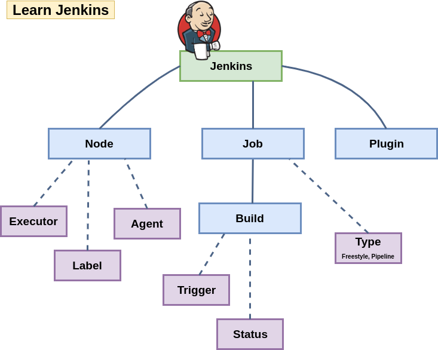

# Jenkins

## Documentation

Title | Author | Comments
:------ |:------|:------:
[Official Jenkins Doc](https://jenkins.io/user-handbook.pdf) | jenkinsci-docs |  |
[Job DSL Plugin](https://jenkinsci.github.io/job-dsl-plugin) | jenkinsci | |

## Tutorials & Articles

Title | Author | Comments
:------ |:------|:------:
[Jenkins Tutorial For Beginners](https://devopscube.com/jenkins-2-tutorials-getting-started-guide) | Focusing on installing and configuring Jenkins
[Top 10 Best Practices for Jenkins Pipeline Plugin](https://www.cloudbees.com/blog/top-10-best-practices-jenkins-pipeline-plugin) | apemberton |  |
[The Need For Jenkins Pipeline](https://www.cloudbees.com/blog/need-jenkins-pipeline) | Viktor Farcic | Great article. Recommended.
[Jenkins Pipeline](https://www.cloudbees.com/blog/jenkins-pipeline) | Viktor Farcic | Another great article from Victor.

## Scripts

Repository | Comments
:------ |:------:
[pipeline-examples](https://github.com/jenkinsci/pipeline-examples) | The [HTML](https://jenkins.io/doc/pipeline/examples) version |
[This Repository](https://github.com/bregman-arie/jenkins-goodies/tree/master/scripts) | |

## Presentations

Title | Author | Comments
:------ |:------|:------:
[Jenkins API](https://www.slideshare.net/ArieBregman/jenkins-api) | Arie Bregman |  |

## Blogs

Name | Comments
:------ |:------:
[Cloudbees Blog](https://www.cloudbees.com/blog) | |
[Jenkins Community Blog](https://jenkins.io/node/) | |

## Videos

Name | Comments
:------ |:------:
[Multi Branch Pipeline](https://www.youtube.com/watch?v=11z2x3VYO_I&t=) | For projects with multiple branches |
[How to create Jenkins Pipeline with an Example](https://www.youtube.com/watch?v=s73nhwYBtzE) | Great for beginners |
[Codifying the Build and Release Process with a Jenkins Pipeline Shared Library](https://www.youtube.com/watch?v=lzzx59kLW9w) |

## Checklist

- [ ] **Terms & Entities**
  - [ ] Job
  - [ ] Build
  - [ ] Plugin
  - [ ] Slave

- [ ] **Job**
  - [ ] Freestyle
  - [ ] Pipeline
    - [ ] Declarative 
    - [ ] Scripted
  - [ ] Checkpoint (cloudbees only at this point)

- [ ] **Slave**
  - [ ] Agent
  - [ ] Executor
  - [ ] Label

### Cheat Sheet

* Set build result to FAILURE/SUCCESS/UNSTABLE: `currentBuild.result = 'FAILURE'`
